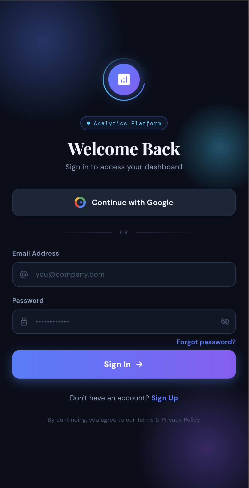
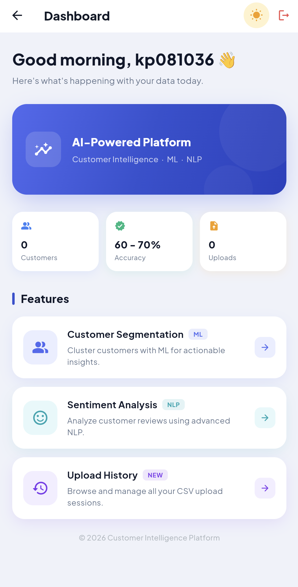
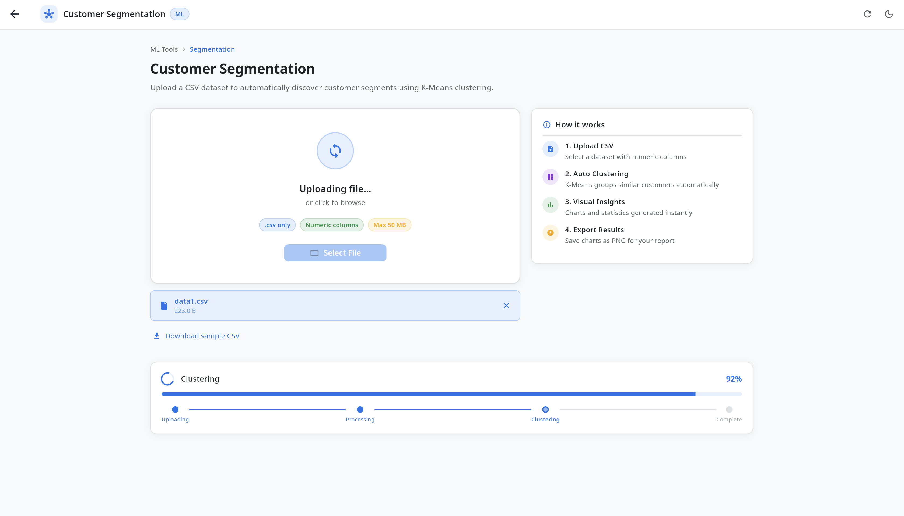
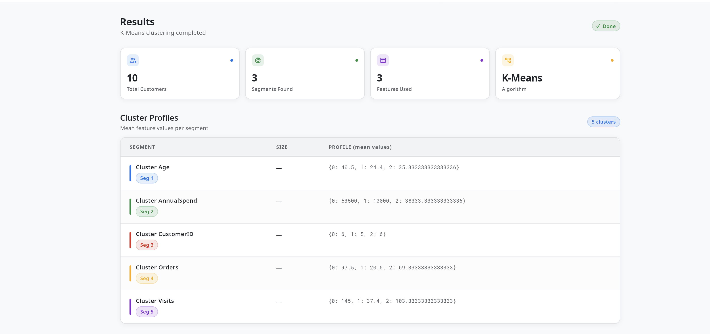
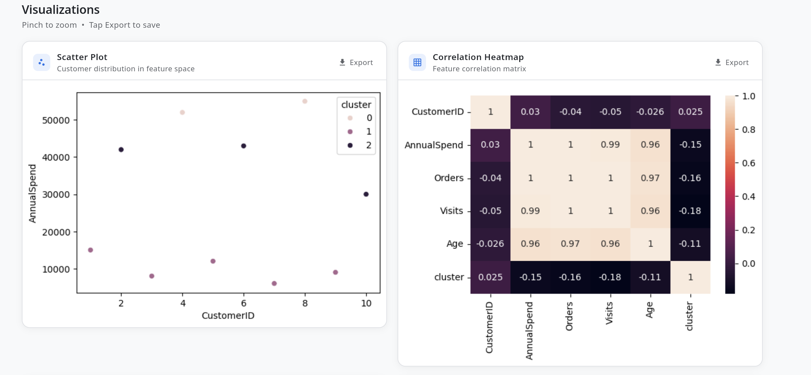
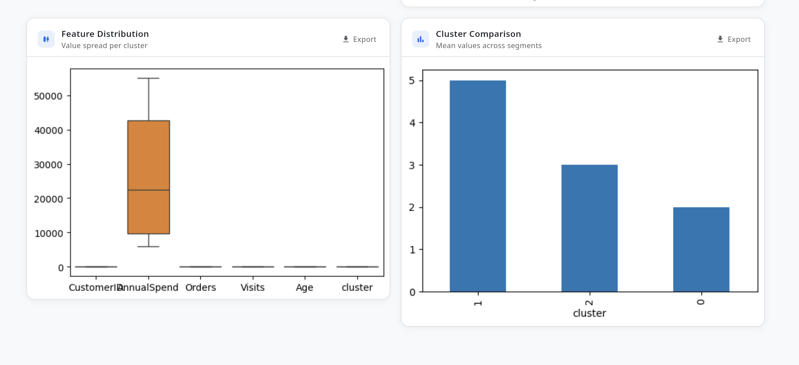
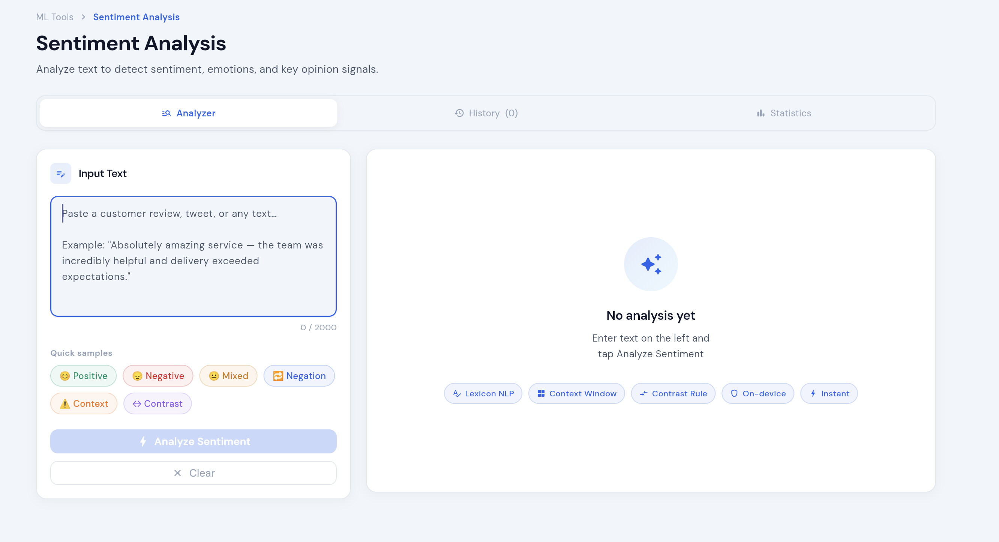

# 🚀 Customer Intelligence Platform  
### Customer Segmentation & Sentiment Analysis

A modern Flutter-based analytics platform that helps businesses understand customer behavior using **Machine Learning (ML)** and **Natural Language Processing (NLP)**.

---

## 📌 Overview

The **Customer Intelligence Platform** is designed to:
- Segment customers using **K-Means Clustering**
- Analyze customer reviews using **Sentiment Analysis (ML)**
- Provide interactive dashboards and visual insights
- Process CSV datasets efficiently

This project is developed as a **Mini Project (2026)**.

---

## ✨ Features

### 🔹 Customer Segmentation
- Uses **K-Means Clustering Algorithm**
- Groups customers based on behavioral data
- Provides cluster insights and profiles

### 🔹 Sentiment Analysis
- Analyzes customer reviews (Positive, Negative, Mixed)
- Uses basic NLP techniques
- Real-time text processing

### 🔹 Dashboard
- Clean and modern UI
- Displays key metrics (Customers, Accuracy, Uploads)
- AI-powered insights overview

### 🔹 CSV Upload
- Upload datasets easily
- Automatic processing and clustering
- Supports numeric datasets

### 🔹 Data Visualization
- Scatter plots
- Correlation heatmaps
- Feature distribution charts
- Cluster comparison graphs

---

## 🛠️ Tech Stack

- **Frontend:** Flutter (Dart)
- **Backend/ML:** Python
- **Algorithms:**
  - K-Means Clustering
  - Sentiment Analysis (NLP basics)
- **Tools:** VS Code, GitHub

---

## 📂 Project Structure

lib/
├── main.dart
├── login_page.dart
├── home_page.dart
├── customer_segmentation_page.dart
├── sentiment_analysis.dart
├── history_page.dart
└── project_intro_page.dart

assets/
images/
pubspec.yaml
README.md

---

## 📸 Screenshots

### 🔹 Home Screen

### 🔹 Login Page

### 🔹 Dashboard

### 🔹 Customer Segmentation

### 🔹 Clustering Results

### 🔹 Data Visualizations

### 🔹 Feature Distribution

### 🔹 Sentiment Analysis

---

## ⚙️ How to Run

1. Clone the repository:
git clone https://github.com/your-username/your-repo-name.git

2. Navigate to project:
cd your-repo-name

3. Install dependencies:
flutter pub get

4. Run the app:
flutter run

---

## 📊 Sample Workflow

1. Upload CSV dataset  
2. System processes data  
3. K-Means clustering applied  
4. Results & visualizations generated  
5. Analyze customer insights  

---

## 🎯 Future Enhancements

- Improve ML model accuracy  
- Add real-time API integration  
- Advanced NLP models  
- User authentication system  
- Cloud deployment  

---

## 👨‍💻 Author

**Pranith Konda**  
BTech CSE Student  

---

## 📄 License

This project is developed for educational purposes.